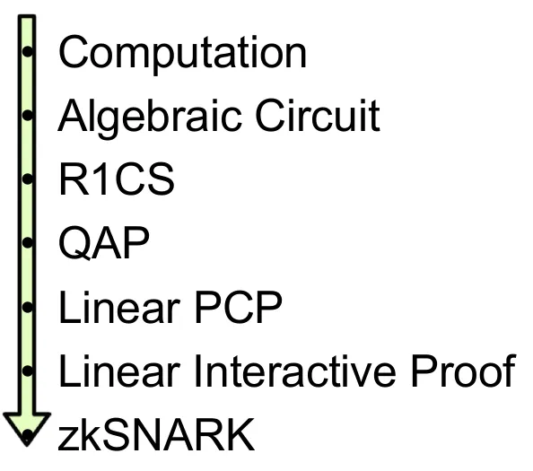

# Quadratic Arithmetic Programs (QAP)

[Quadratic Arithmetic Programs](https://medium.com/@VitalikButerin/quadratic-arithmetic-programs-from-zero-to-hero-f6d558cea649)

The purpose of this post is not to serve as a full introduction to zk-SNARKs but rather to introduce the first half of the zk-SNARKs
pipeline as follows.

The process unfolds in two phases. Initially, zk-SNARKs cannot directly address computational problems; they require
conversion into the appropriate "form" known as a "quadratic arithmetic program" (QAP).

Taking the example equation $x^3 + x + 5 = 35$ in zk-SNARKs, the prover aims to demonstrate knowledge of the answer,
$x = 3$.

## Flattening

Break down the equation into statements of two forms: $x = y$ and $x = y$ (op) $z$, where op can be +, -, *, /, and y
and z can be variables, numbers, or sub-expressions. Think of these as logic gates in a circuit.

The flattened result for the given equation:

- $sym_1 = x * x$
- $y = sym_1 * x$
- $sym_2 = y + x$
- $~out = sym_2 + 5$

## R1CS

Rank-1 Constraint System (R1CS) transforms each flattened equation into a constraint system
using the formula: $A . s * B . s - C . s = 0$, where A, B, C are vectors representing variable mappings,
and s is the full variable list.

Transform the equation as follows:

$$
\begin{align}
C = A * B \\
\iff A * B - C = 0 \\
\end{align}
$$

Equations become:

- $x * x - sym_1 = 0$
- $x * sym_1 - y = 0$
- $(x+y)*1 = sym_2$
- $(sym_2 + 5)*1 - ~out = 0$

Map the lines into vectors A, B, and C using the given format: ['~one', 'x', '~out', 'sym_1', 'y', 'sym_2']

Mapping vectors A, B, C, and variable vector s:

A:

$[0, 1, 0, 0, 0, 0]$

$[0, 0, 0, 1, 0, 0]$

$[0, 1, 0, 0, 1, 0]$

$[5, 0, 0, 0, 0, 1]$

B:

$[0, 1, 0, 0, 0, 0]$

$[0, 1, 0, 0, 0, 0]$

$[1, 0, 0, 0, 0, 0]$

$[1, 0, 0, 0, 0, 0]$

C:

$[0, 0, 0, 1, 0, 0]$

$[0, 0, 0, 0, 1, 0]$

$[0, 0, 0, 0, 0, 1]$

$[0, 0, 1, 0, 0, 0]$

s:

$[1, 3, 35, 9, 27, 30]$

To validate $A . s * B . s - C . s = 0$, leverage the dot product property. For instance, apply it to the first line of
A, B, and C: $x * x - sym_1 = 0$.

## QAP

Transform all columns of A into a matrix of polynomials $f(x)$ of $n-1$ degree
using [Lagrange interpolation](../../terms/lagrange_interpolation.md).

For instance, the first column of matrix A is $[0, 0, 0, 5]$. Use Lagrange interpolation to find a degree-3 polynomial
that equals these values at $x=1, x=2, x=3,$ and $x=4$.

So we have $f_{A1}(x)$ as the function represent the first column of matrix A.

$f_{A2}(x)$ as the function represent the second column of matrix A.

And so on...

Evaluate each polynomial at the corresponding points, forming a vector equal to the entire first row of A:
$[f_{A1}(1), f_{A2}(1), f_{A3}(1), f_{A4}(1), f_{A5}(1)]$

This provides three sets of polynomials satisfying $t(x) = A(x).s * B(x).s - C(x).s = 0$ at $x=1, x=2, x=3, x=4$.

This implies that the equation $t(x) = 0$ has roots at $x=[1, 2, 3, 4]$ or has the form $(x-1)(x-2)(x-3)(x-4)h(x)$ with
$h(x)$ as a function.

For a faster check, divide $t(x)$ by a basic polynomial $Z$ = $(x-1)(x-2)(x-3)(x-4)$ to obtain $h(x)$ with no remainder.

The system can be manipulated, for example, by using input values where matrix A equals matrix C, and matrix B has a scalar value (s)
equal to 1. This effectively checks whether A multiplied by 1 is equal to C multiplied by 1.

Thus, the process is not complete yet.

[Next article](../zk-snarks-under-the-hood/zk_snarks_under_the_hood.md)
