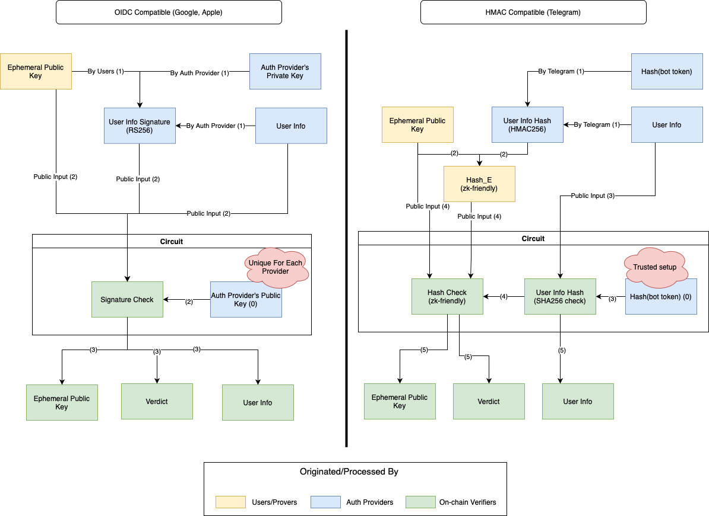

# Keyless Account for Telegram

!TOC

## Introduction

Currently, there is support for users to utilize web3 applications without managing their own public and private key pairs, and without
using custodial wallets, by using their credentials directly from authentication providers like Google or Apple. This is made possible
thanks to zero-knowledge (ZK) technology and account abstraction. However, the current solution
(e.g., [zkLogin](https://docs.sui.io/concepts/cryptography/zklogin)) only supports authentication providers that offer OIDC (OpenID
Connect). Other providers like Telegram cannot be supported using the same technique, so we need to devise an alternative solution.

In this document, we will analyze and then try to introduce the modified flow that is suited for Telegram.

> [!NOTE]
> Although we couldn't successfully create a fully working flow. we hope that this will help to bring some info for the interested
> reader.

## Telegram OAuth Properties

Telegram uses the HMAC-SHA-256 signature scheme.

To integrate Telegram authentication, you need to create a bot. Each bot has a unique `bot_token` used by Telegram to create a valid
signature for the user upon successful authorization. More details can be found in
the [Telegram Login Widget](https://core.telegram.org/widgets/login).

Unlike OIDC, which uses RS256 where only the authentication provider's server can generate a valid signature, HMAC-SHA-256 allows both
the authentication server and the recipient (in this case, our app) to generate valid signatures.

There is no support for custom fields as opposed to OIDC, which users can use to attach additional information to the authentication
signature. This provides an easy way (as demonstrated in steps (1) and (2) in the OIDC Compatible section of the figure below) to
ensure no one else can create a valid proof and link it with an arbitrary web3 account.

## The Overview Flow

0. **Bot Token Creation:** The first step (denoted as step 0 in the figure above) is to create a `bot_token` by following the Telegram
   instructions. Embed this token (as private) into our circuit so that the circuit can verify the hash without anyone else knowing it.
   Since anyone with the bot token can create a valid signature, we need to discard this information (and its hash value) as soon as we
   are done generating the circuit.

1. **User Information Hashing:** When the user logs into Telegram successfully, Telegram will provide us with the `user_info_hash`,
   which is derived from the `bot_token` and the `user_info`.

2. **Ephemeral Key Pair Creation:** The user needs to create an `ephemeral key pair` to interact with the blockchain. Then, hash this
   key pair with the received `user_info_hash`, creating `Hash_E`. This information will be put into the circuit to prevent attacks
   like frontrunning. Without this step, attackers could attach our proof to any ephemeral account of their choice and still pass all
   the checks. Use a zk-friendly hash for efficiency purposes, such as Poseidon.

3. **Circuit Verification:** In the circuit, use the `user_info` provided by the user and combine it with the
   embedded `Hash(bot_token)` value to calculate the `user_info_hash`. This is done in an encrypted context (a feature provided by
   using [Homomorphic Commitment](../terms/homomorphic_encryption.md) techniques) so no one can read it.

4. **Hash Consistency Check:** The newly calculated `user_info_hash` is combined with the `ephemeral public key` provided by the user
   to compare with `Hash_E` to ensure consistency.

5. **Circuit Output:** After verification, the circuit outputs the `ephemeral public key`, the verdict on whether the user input passes
   all checks, and the user info. These values can then be used in the smart contract to serve our business logic. The smart contract
   can trust that the `ephemeral public key` belongs to a user who has been authenticated by Telegram, allowing for secure interactions
   on the blockchain.

## Appendix

### HMAC

This definition is taken from [RFC 2104](https://datatracker.ietf.org/doc/html/rfc2104):

$$  
\begin{align}  
\text{HMAC}(K, m) &= \text{H}\Bigl(\bigl(K' \oplus opad\bigr) \parallel  
\text{H} \bigl(\left(K' \oplus ipad\right) \parallel m\bigr)\Bigr) \\  
K' &= \begin{cases}  
\text{H}\left(K\right) & \text{if K is larger than block size} \\  
K & \text{otherwise}  
\end{cases}  
\end{align}  
$$

where:

- `H` is a cryptographic hash function.
- `m` is the message to be authenticated.
- `K` is the secret key.
- `K'` is a block-sized key derived from the secret key, either by padding to the right with 0s up to the block size, or by hashing
  down to less than or equal to the block size first and then padding to the right with zeros.
- $\parallel$ denotes `concatenation`.
- $\oplus$ denotes bitwise `exclusive or` (XOR).
- `opad` is the block-sized outer padding, consisting of repeated bytes valued `0x5c`.
- `ipad` is the block-sized inner padding, consisting of repeated bytes valued `0x36`.

### HMAC-SHA-256

This is basically using HMAC with SHA-256 as the hash function.
