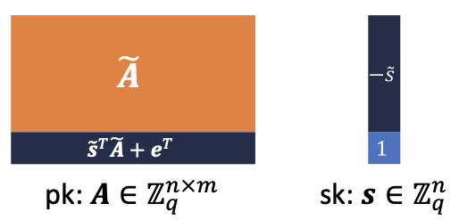
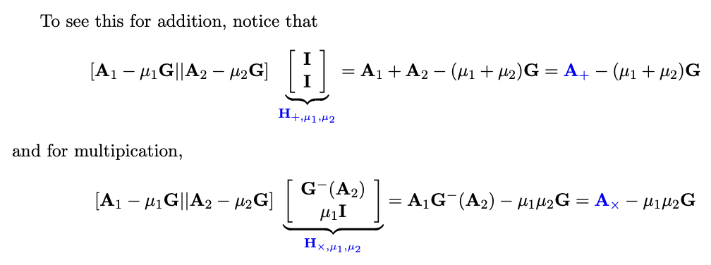
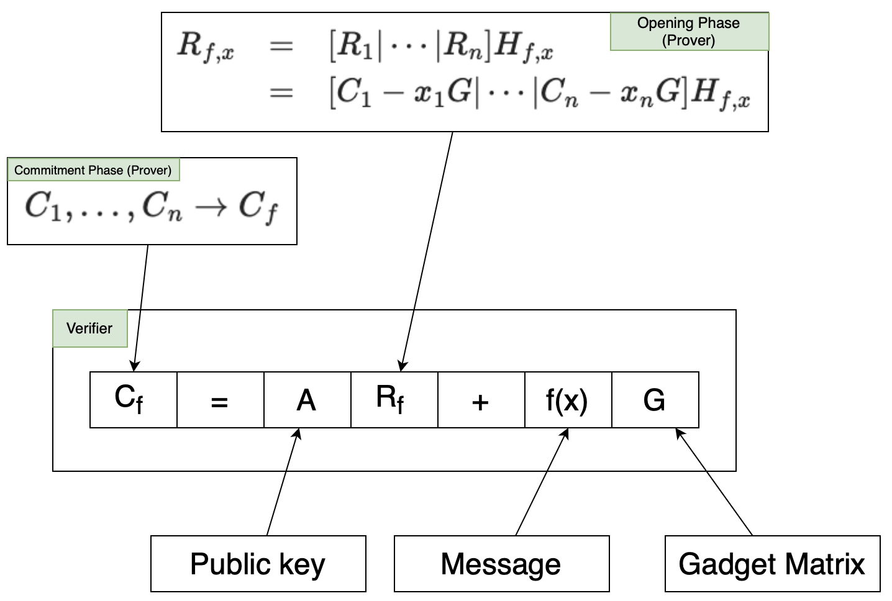

# The GSW FHE Scheme

**References:**

- [Computing with Lattices](https://www.cs.utexas.edu/~dwu4/talks/HS-ZK0320.pdf)
- [Homomorphic Signatures and Pre-Processing NIZK](https://www.youtube.com/watch?v=yFBsQ_5yUUw)

## GSW Encryption Scheme

### Keys

- $A$: The public key; an [LWE matrix](../terms/learning_with_errors.md) (columns are LWE samples): $s^T A = e^T \approx 0^T$
- $s$: The secret key.

### Encryption

- **$R$**: A random short matrix.
- **Ciphertext for $x \in \{0,1\}$**:

$$
C = AR + xG
$$

- **[Gadget Matrix](../terms/gadget_matrix.md) $G$**: A matrix that makes it easy to solve $x$ given $G$ and $s$:

$$
G = (1, 2, 4, \ldots, 2^l) \otimes I_n \in \mathbb{Z}_q^{n \times nl}
$$

- **Public Trapdoor**: The "binary decomposition," $G^{-1}:\mathbb{Z}_q^{n \times nl} \rightarrow \{0,1\}^{nl \times k}$ such that

$$
GG^{-1}(A) = A
$$

### Decryption

$$
s^T C = s^T AR + x \cdot s^T G \approx x \cdot s^T G
$$

## Homomorphic Operations in GSW

[Homomorphic Encryption](../terms/homomorphic_encryption.md)

Given:

$$
\begin{array}{c}
C_1 = AR_1 + x_1 G \\
C_2 = AR_2 + x_2 G
\end{array}
$$

### Addition

$$
C_+ = C_1 + C_2 = A(R_1 + R_2) + (x_1 + x_2)G
$$

Let $R_+ = R_1 + R_2$:

$$
C_+ = C_1 + C_2 = AR_+ + (x_1 + x_2)G
$$

### Multiplication

$$
\begin{array}{rcl}
C_\times &=& C_1 G^{-1}(C_2) \\
&=& AR_1 G^{-1}(C_2) + x_1 G G^{-1}(C_2)\\
&=& AR_1 G^{-1}(C_2) + x_1 C_2\\
&=& AR_1 G^{-1}(C_2) + x_1 (AR_2 + x_2 G)\\
&=& A(R_1 G^{-1}(C_2) + x_1 R_2) + x_1 x_2 G \\
&=& AR_\times + x_1 x_2 G
\end{array}
$$

### Correctness

- $R_1$, $R_2$, $x_1$ are short, so $R_+$ and $R_\times$ are also short.

### Evaluation

Given:

$$
\begin{array}{c}
C_1 = AR_1 + x_1 G \\
C_2 = AR_2 + x_2 G \\
\ldots \\
C_n = AR_n + x_n G
\end{array}
$$

Compute:

$$
C_f = AR_{f,x} + f(x) G
$$

#### Input-Independent Evaluation

- **Input**: $C_1, \ldots, C_n, f$
- **Formula**: $C_1, \ldots, C_n \rightarrow C_f$

#### Input-Dependent Evaluation

- **Input**: $C_1, \ldots, C_n, f, x$
- **Formula**: $[C_1 - x_1 G | \cdots | C_n - x_n G] H_{f,x} = C_f - f(x)G$

We have:

$$
R_{f,x} = [R_1 | \cdots | R_n] H_{f,x}
$$

and $H_{f,x}$ is short.

Example: [Lattices, Learning with Errors (page 73)](https://people.csail.mit.edu/vinodv/CS294/lecturenotes.pdf)

Where $A$ is actually $C$ and $\mu$ is actually $x$.

## GSW as a Homomorphic Commitment

$$
C = AR + xG
$$

- View $C$ as the commitment, $x$ as the message, and $R$ as the opening (must be short).

- **Statistically Binding**: Follows from the correctness of GSW (in fact, extractable).
- **Computationally Hiding**: Follows from the security of GSW (under LWE).

### Commitment Procedure

Given:

$$
\begin{array}{c}
C_1 = AR_1 + x_1 G \\
C_2 = AR_2 + x_2 G \\
\ldots \\
C_n = AR_n + x_n G
\end{array}
$$

Each $C$ represents a commitment for a separate value.

- **Commitment**:

$$
C_f = AR_{f,x} + f(x) G
$$

The verifier can compute this using the "Input-Independent Evaluation" technique above.

> [!NOTE]
> We can choose $A$ as a uniformly random matrix since we don't need to decrypt the message.

- **Opening**:

$$
\begin{array}{rcl}
R_{f,x} & = & [R_1 | \cdots | R_n] H_{f,x} \\
& = & [C_1 - x_1 G | \cdots | C_n - x_n G] H_{f,x}
\end{array}
$$

- By using this formula, the verifier doesn't need to know any $R_i$.
- The prover knows $R_1, \ldots, R_n$.
- $H_{f,x}$ can be computed given the function $f$ and $x$.

- **Check**:
  - The verifier can then verify $C_f = AR_{f,x} + f(x)G$ as described in the picture above.
