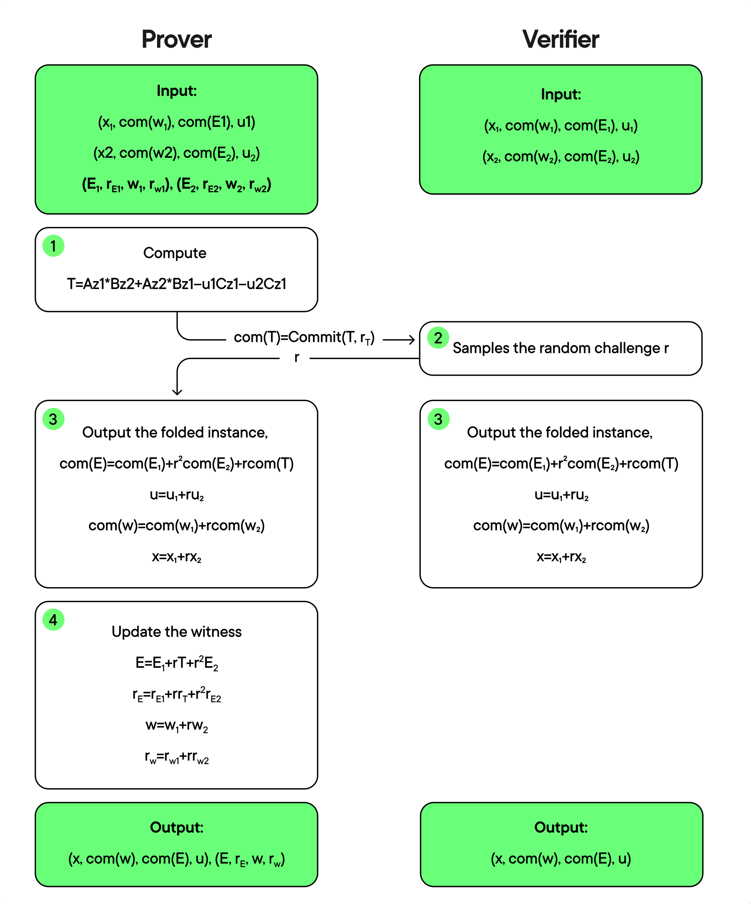

# Nova
## Recursive SNARKs

Read the definition of recursive SNARK [here](../terms/recursive_snark.md).

## IVC

Read the definition of IVC [here](../terms/ivc.md).

## Folding Scheme

Read the definition of the folding scheme [here](../terms/folding_scheme.md).

## R1CS

Read the definitions of R1CS, Relaxed R1CS and Committed Relaxed R1CS [here](../terms/r1cs.md).

## Folding Scheme for Committed Relaxed R1CS

For Committed Relaxed R1CS, we use succinct and hiding additively 
[homomorphic commitments](../terms/homomorphic_encryption.md) for 
$W$ and $E$ in the instance, and treat both $W$ and $E$ as the witness.

Specifically, we can compress $Z_1$ and $Z_2$ into a single $Z$ using 
Random Linear Combination. This technique uses a random $r$ and 
computes:
- $Z_1 = (W_1, x_1, u_1)$, $Z_2 = (W_2, x_2, u_2)$, $Z = (W, x, u)$.
- $x = x_1 + r \cdot x_2$
- $W = W_1 + r \cdot W_2$
-  $u = u_1 + r \cdot u_2$
- $E = E_1 + r\cdot (AZ_1 \circ BZ_2 + AZ_2 \circ BZ_1 − u_1CZ_2 − u_2CZ_1) + r^2 \cdot E_2$

Thus, the R1CS satisfied condition still holds:

$$
\begin{array}{rcl}
AZ \circ BZ & = & A(Z_1 + r \cdot Z_2) \circ B(Z_1 + r \cdot Z_2) \\
& = & (u_1CZ_1 + E_1) + r \cdot (AZ_1 \circ BZ_2 + AZ_2 \circ BZ_1) + r^2 \cdot (u_2CZ_2 + E_2) \\
& = & (u_1 + r \cdot u_2) C(Z_1 + rZ_2) + E \\
& = & uCZ + E.
\end{array}
$$

So, the folding scheme prover and the folding scheme verifier 
proceed as follows:

- **Prover (P)**: sends $\bar{T} = \text{Com}(T, r_T)$ where: 
		$T = AZ_1 \circ BZ_2 + AZ_2 \circ BZ_1 − u_1CZ_2 − u_2CZ_1$
  as the cross-term.  
- **Verifier (V)**: sends a random challenge: $r$.
- **Verifier (V) and Prover (P)**: output the folded instance: $(\bar E, u, \bar{W}, x)$:
	- $\bar{E} \leftarrow \bar{E_1} + r \cdot T + r^2 \cdot \bar{E_2}$
	- $u \leftarrow u_1 + r \cdot u_2$
	- $\bar{W} \leftarrow \bar{W_1} + r \cdot \bar{W_2}$
	- $x \leftarrow x_1 + r \cdot x_2$
- **Prover (P)**: outputs the folded witness $E, r_E, W, r_W$, where:
	- $E \leftarrow E_1 + r \cdot T + r^2 \cdot E_2$
	- $r_E \leftarrow r_{E_1} + r \cdot r_T + r^2 \cdot r_{E_2}$ 
	- $W \leftarrow W_1 + r \cdot W_2$
	- $r_W \leftarrow r_{W_1} + r \cdot r_{W_2}$
	
Then, the Prover (P) can claim his correct folding by proving that $\bar{W}$ and $\bar{E}$ 
are the commitments of $W$ and $E$. 

You should see the depiction below:

We can make this protocol non-interactive via [Fiat-Shamir](../terms/fiat_shamir.md). Let $\rho$ 
denote a [random oracle](../terms/random_oracle_model.md), then 
the Prover (P) can get random challenge $r$ via:

$r \leftarrow \rho(vk, u_1, u_2, \bar T)$.